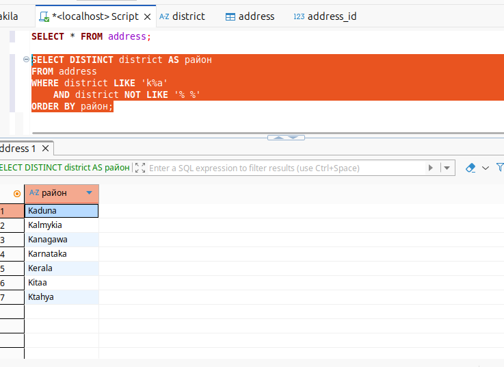

# Домашнее задание к занятию «SQL. Часть 1» Шелухин Юрий

### Задание 1 
Получите уникальные названия районов из таблицы с адресами, которые начинаются на “K” и заканчиваются на “a” и не содержат пробелов. 
---

#### Решение 1.
1.1. Запустим MYSQL в контейнере Docker-compose.    
`docker-compose up -d`     
1.2. Откроем SQL-скрипт. Выполним запрос для прросмотра названия колонок.       
`SELECT * FROM address;` 
    
Выполним запрос для по условию задания.  
`SELECT DISTINCT district AS район
FROM address
WHERE district LIKE 'K%a' 
  AND district NOT LIKE '% %'
ORDER BY район;` 
 
---
 

### Задание 2
Получите из таблицы платежей за прокат фильмов информацию по платежам, которые выполнялись в промежуток с 15 июня 2005 года по 18 июня 2005 года включительно и стоимость которых превышает 10.00.
---

#### Решение 2.
Выполним запрос для по условию задания.    
`SELECT payment_date AS 'дата платежа',
		amount AS 'стоимость'
FROM payment
WHERE payment_date BETWEEN '2005-06-15 00:00:00' AND '2005-06-18 23:59:59'
	AND amount > 10.00
ORDER BY payment_date;`     
 
---

### Задание 3
Получите последние пять аренд фильмов.

#### Решение 3.
Выполним запрос для по условию задания.      
`SELECT rental_date AS 'дата аренды'
FROM rental
ORDER BY rental_date DESC
LIMIT 5;`     
  
---

### Задание 4
Одним запросом получите активных покупателей, имена которых Kelly или Willie. 
Сформируйте вывод в результат таким образом:
- все буквы в фамилии и имени из верхнего регистра переведите в нижний регистр,
- замените буквы 'll' в именах на 'pp'.
---

#### Решение 4.
Выполним запрос для по условию задания.      
`SELECT
	REPLACE(LOWER(first_name), 'll', 'pp') AS 'Имя',
	REPLACE(LOWER(last_name), 'll', 'pp') AS 'Фамилия',
	email AS 'Электронная почта'		
FROM customer
WHERE first_name = 'Kelly' OR first_name = 'Willie'
ORDER BY last_name;`     
  
---

### Задание 5*
Выведите Email каждого покупателя, разделив значение Email на две отдельных колонки: в первой колонке должно быть значение, указанное до @, во второй — значение, указанное после @.
---

#### Решение 5*.
Выполним запрос для по условию задания.      
`SELECT
	LEFT(email, POSITION('@' IN email) - 1) AS 'Имя пользователя',
    RIGHT(email, LENGTH(email) - POSITION('@' IN email)) AS 'Домен',
	email AS 'Электронная почта'		
FROM customer
WHERE POSITION('@' IN email) > 0
ORDER BY email;`     
  
---

### Задание 6*
Доработайте запрос из предыдущего задания, скорректируйте значения в новых колонках: первая буква должна быть заглавной, остальные — строчными.

#### Решение 6*.
Выполним запрос для по условию задания.      
`SELECT
	CONCAT(
        UPPER(LEFT(LEFT(email, POSITION('@' IN email) - 1), 1)),
        LOWER(SUBSTRING(LEFT(email, POSITION('@' IN email) - 1) FROM 2))) AS 'Имя пользователя',
    CONCAT(
        UPPER(LEFT(RIGHT(email, LENGTH(email) - POSITION('@' IN email)), 1)),
        LOWER(SUBSTRING(RIGHT(email, LENGTH(email) - POSITION('@' IN email)) FROM 2))) AS 'Домен',
	email AS 'Электронная почта'		
FROM customer
WHERE POSITION('@' IN email) > 0
ORDER BY email;`     
  
---

