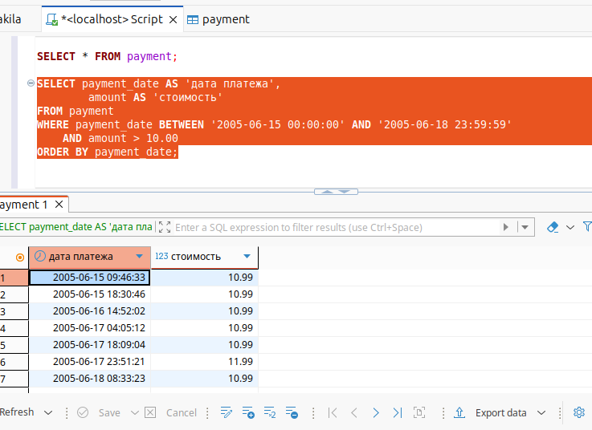

# Домашнее задание к занятию «SQL. Часть 1» Шелухин Юрий

### Задание 1 
Получите уникальные названия районов из таблицы с адресами, которые начинаются на “K” и заканчиваются на “a” и не содержат пробелов. 
---

#### Решение 1.
1.1. Запустим MYSQL в контейнере Docker-compose.    
`docker-compose up -d`     
1.2. Откроем SQL-скрипт. Выполним запрос для прросмотра названия колонок.       
`SELECT * FROM address;` 
    
Выполним запрос для по условию задания.  
`SELECT DISTINCT district AS район
FROM address
WHERE district LIKE 'K%a' 
  AND district NOT LIKE '% %'
ORDER BY район;` 
 
---

### Задание 12
Получите из таблицы платежей за прокат фильмов информацию по платежам, которые выполнялись в промежуток с 15 июня 2005 года по 18 июня 2005 года включительно и стоимость которых превышает 10.00.

#### Решение 2.
Получить данные можно визуальным изучением таблиц  
   
   
или с помощью sql-скрипта  
`SELECT 
    t.TABLE_NAME,
    k.COLUMN_NAME AS PRIMARY_KEY,
    k.CONSTRAINT_NAME
FROM information_schema.TABLES   k 
    ON t.TABLE_SCHEMA = k.TABLE_SCHE
    AND t.TABLE_NAME = k.TABLE_NAME 
    AND k.CONSTRAINT_NAME = 'PRIMARY'
WHERE t.TABLE_SCHEMA = 'sakila'
    AND t.TABLE_TYPE = 'BASE TABLE'
ORDER BY t.TABLE_NAME;`  

[файл в формате Excel](files/task_2.ods)
---

### Задание 3
Получите последние пять аренд фильмов.

#### Решение 3*.
Выдадим все права.    
`GRANT ALL PRIVILEGES ON sakila.* TO 'sys_temp'@'%';`    
Исключим права на модификацию.    
`REVOKE INSERT, UPDATE, DELETE ON sakila.* FROM 'sys_temp'@'%';`  
Применим изменения.    
`FLUSH PRIVILEGES;`  
Проверим права.  
`SHOW GRANTS FOR 'sys_temp'@'%';`  
  
---

### Задание 4
Одним запросом получите активных покупателей, имена которых Kelly или Willie. 
Сформируйте вывод в результат таким образом:
- все буквы в фамилии и имени из верхнего регистра переведите в нижний регистр,
- замените буквы 'll' в именах на 'pp'.

## Дополнительные задания (со звёздочкой*)
Эти задания дополнительные, то есть не обязательные к выполнению, и никак не повлияют на получение вами зачёта по этому домашнему заданию. Вы можете их выполнить, если хотите глубже шире разобраться в материале.

### Задание 5*
Выведите Email каждого покупателя, разделив значение Email на две отдельных колонки: в первой колонке должно быть значение, указанное до @, во второй — значение, указанное после @.

### Задание 6*
Доработайте запрос из предыдущего задания, скорректируйте значения в новых колонках: первая буква должна быть заглавной, остальные — строчными.

